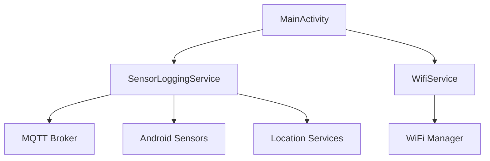
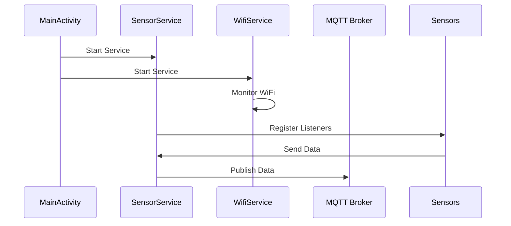
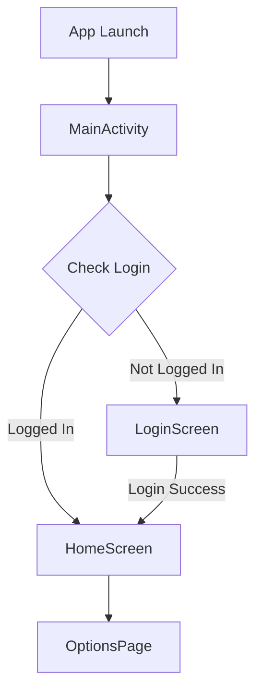

# WatchApp - Architecture Overview

## 📦 Project Structure
```

```

## 🔄 Component Dependencies

### 1. Core Dependencies
```kotlin
// build.gradle.kts
dependencies {
    // Android Core
    implementation("androidx.core:core-ktx:1.12.0")
    implementation("androidx.wear:wear:1.3.0")
    
    // Compose
    implementation("androidx.wear.compose:compose-material:1.2.1")
    implementation("androidx.wear.compose:compose-foundation:1.2.1")
    
    // MQTT
    implementation("org.eclipse.paho:org.eclipse.paho.client.mqttv3:1.2.5")
    implementation("org.eclipse.paho:org.eclipse.paho.android.service:1.1.1")
    
    // Location Services
    implementation("com.google.android.gms:play-services-location:21.0.1")
    
    // Security
    implementation("androidx.security:security-crypto:1.1.0-alpha06")
}
```

## 🔗 Component Connections

### 1. Service Communication


### 2. Data Flow


## 📱 Screen Navigation

### 1. Screen Flow


## 🔐 Security Implementation

### 1. Secure Storage
```kotlin
// LoginCache.kt
class LoginCache(private val context: Context) {
    private val masterKey = MasterKey.Builder(context)
        .setKeyScheme(MasterKey.KeyScheme.AES256_GCM)
        .build()

    private val sharedPreferences = EncryptedSharedPreferences.create(
        context,
        "login_cache",
        masterKey,
        EncryptedSharedPreferences.PrefKeyEncryptionScheme.AES256_SIV,
        EncryptedSharedPreferences.PrefValueEncryptionScheme.AES256_GCM
    )
}
```

## 📊 Data Management

### 1. Queue System
```kotlin
// SensorLoggingService.kt
class SensorLoggingService : Service() {
    // Data Queues
    private val gpsDataQueue = ArrayBlockingQueue<String>(5000)
    private val accelDataQueue = ArrayBlockingQueue<String>(5000)
    private val heartRateDataQueue = ArrayBlockingQueue<String>(5000)
    private val gyroDataQueue = ArrayBlockingQueue<String>(5000)
}
```

## 🔄 Background Processing

### 1. Service Management
```kotlin
// MainActivity.kt
class MainActivity : ComponentActivity() {
    private fun startServices() {
        // Start Sensor Service
        val sensorIntent = Intent(this, SensorLoggingService::class.java)
        startForegroundService(sensorIntent)

        // Start WiFi Service
        val wifiIntent = Intent(this, WifiService::class.java)
        startForegroundService(wifiIntent)
    }
}
```

## 📡 Network Communication

### 1. MQTT Topics
```kotlin
// SensorLoggingService.kt
private val mqttTopic = "wearos/accelerometer"
private val mqttGpsTopic = "wearos/gps"
private val mqttGyroscope = "wearos/gyroscope"
private val mqttHeartRateTopic = "wearos/heart_rate"
private val mqttSkinTempTopic = "wearos/skin_temp"
```

## 🔍 Error Handling

### 1. Service Error Recovery
```kotlin
// SensorLoggingService.kt
private fun publishMqttInternal(topic: String, message: String, maxRetries: Int = 3) {
    var attempts = 0
    while (attempts <= maxRetries) {
        if (mqttClient.isConnected) {
            try {
                mqttClient.publish(topic, MqttMessage(message.toByteArray()))
                return
            } catch (e: MqttException) {
                attempts++
                if (attempts <= maxRetries) {
                    Thread.sleep(1000)
                }
            }
        } else {
            connectMqtt()
            return
        }
    }
}
```

## 📱 UI Components

### 1. Screen Structure
```kotlin
// MainActivity.kt
@Composable
fun AppContent(
    currentScreen: Screen,
    onNavigate: (Screen) -> Unit,
    // ... other parameters
) {
    when (currentScreen) {
        Screen.Login -> LoginScreen(...)
        Screen.Home -> HomeScreen(...)
        Screen.OptionsPage -> OptionsPage()
    }
}
```

## 🔄 State Management

### 1. UI State
```kotlin
// MainActivity.kt
private val dataSendingStatus = mutableStateOf("Not sending data")
private val gpsDataState = mutableStateOf("No GPS data yet")
private val latitudeState = mutableStateOf("...")
private val longitudeState = mutableStateOf("...")
private val userIdState = mutableStateOf("")
private val heartRateState = mutableStateOf("...")
```

---

*This documentation provides a comprehensive overview of the application's architecture, showing how different components interact and depend on each other. The structure is designed to be maintainable, scalable, and efficient in handling sensor data collection and transmission.* 
