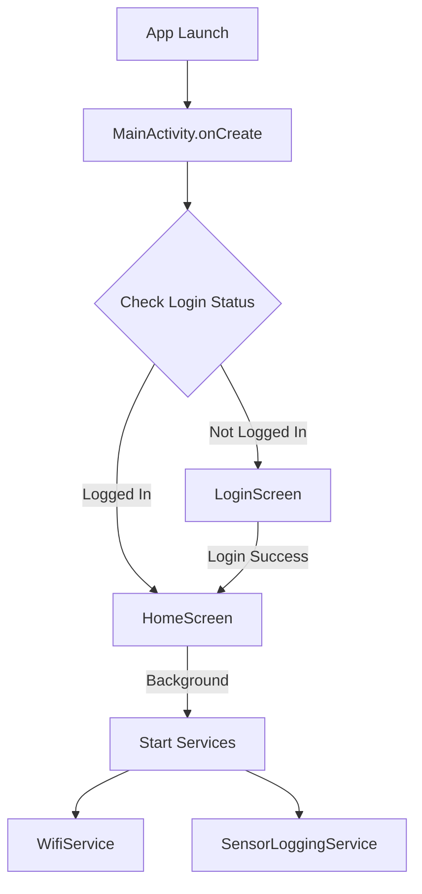
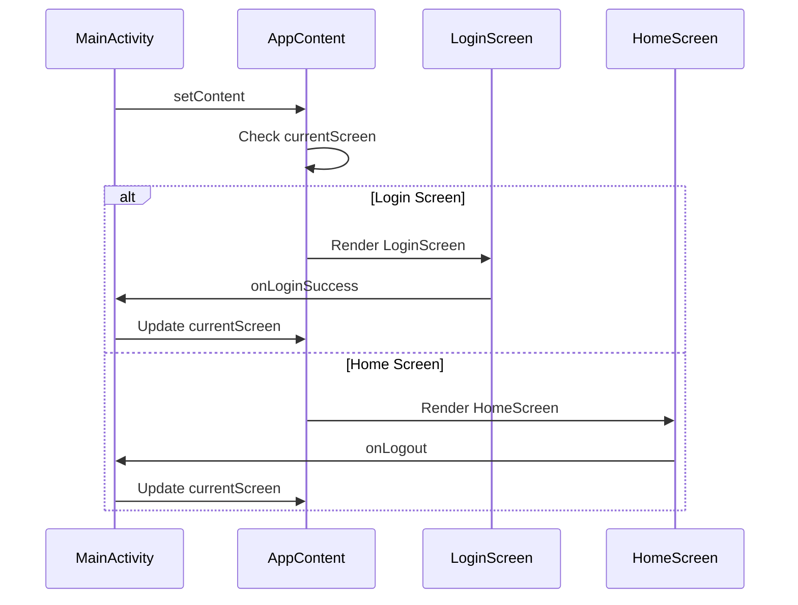
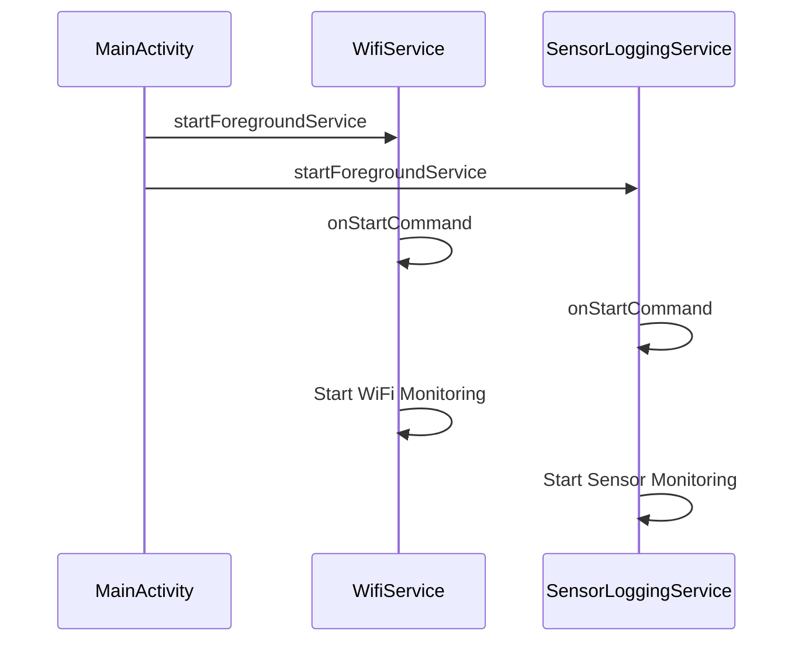
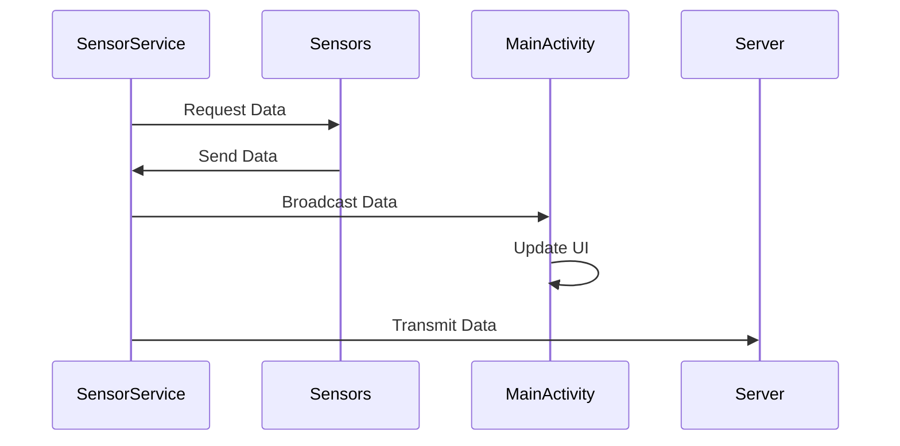
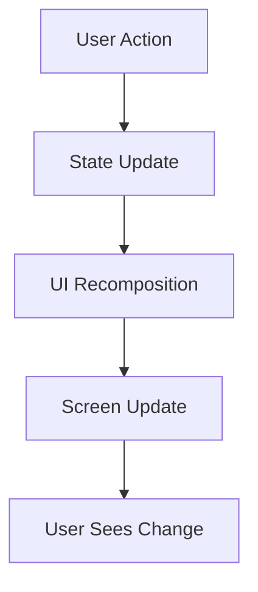
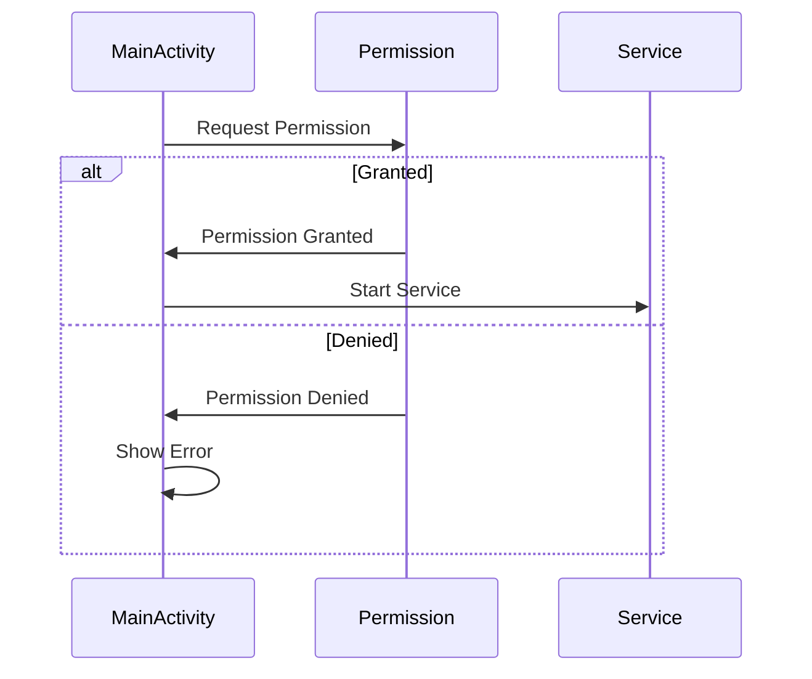
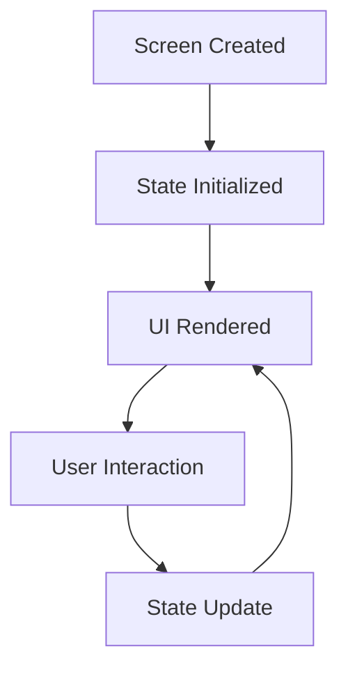

# WatchApp - Code Flow Documentation

## 🔄 Application Flow Overview



## 📱 Entry Point: MainActivity

### 1. Application Launch
```kotlin
class MainActivity : ComponentActivity() {
    override fun onCreate(savedInstanceState: Bundle?) {
        super.onCreate(savedInstanceState)
        // Initialize login cache
        loginCache = LoginCache(applicationContext)
        
        // Check initial login state
        val initialScreen = if (checkIfUserIsLoggedIn() && cachedUserId != null) {
            userIdState.value = cachedUserId
            Screen.Home
        } else {
            Screen.Login
        }
        
        // Set up the UI
        setContent {
            AppContent(...)
        }
    }
}
```

### 2. Screen Navigation Flow


## 🔐 Authentication Flow

### 1. Login Process
```kotlin
// LoginScreen.kt
@Composable
fun LoginScreen(
    onLoginSuccess: (String, String) -> Unit,
    ...
) {
    // 1. User enters credentials
    var username by remember { mutableStateOf("") }
    var password by remember { mutableStateOf("") }

    // 2. Login button click
    Button(onClick = {
        // 3. Check Wi-Fi connection
        if (!isWifiConnected(context)) {
            Toast.makeText(context, "Wi-Fi not connected", Toast.LENGTH_SHORT).show()
            return@Button
        }

        // 4. Send login request
        sendLoginDataToApi(username, password, coroutineScope) { result ->
            if (result == "Login Success!") {
                // 5. Save login state
                loginCache.saveLoginStatus(true)
                loginCache.saveUserId(username)
                // 6. Navigate to home
                onLoginSuccess(username, password)
            }
        }
    })
}
```

## 🔄 Background Services Flow

### 1. Service Initialization


### 2. WifiService Flow
```kotlin
class WifiService : Service() {
    override fun onStartCommand() {
        // 1. Create WiFi suggestion
        val suggestion = WifiNetworkSuggestion.Builder()
            .setSsid("w03test3")
            .setWpa2Passphrase("Hmgics2025!")
            .build()

        // 2. Add network suggestion
        wifiManager.addNetworkSuggestions(listOf(suggestion))

        // 3. Start monitoring connection
        startWifiMonitoring()
    }
}
```

### 3. SensorLoggingService Flow
```kotlin
class SensorLoggingService : Service() {
    override fun onStartCommand() {
        // 1. Initialize sensors
        initializeSensors()

        // 2. Start data collection
        startHeartRateMonitoring()
        startLocationTracking()
        startStepCounting()

        // 3. Start data transmission
        startDataTransmission()
    }
}
```

## 📊 Data Flow

### 1. Sensor Data Collection


### 2. Data Storage Flow
```kotlin
class LoginCache(private val context: Context) {
    // 1. Initialize secure storage
    private val masterKey = MasterKey.Builder(context)
        .setKeyScheme(MasterKey.KeyScheme.AES256_GCM)
        .build()

    // 2. Create encrypted preferences
    private val sharedPreferences = EncryptedSharedPreferences.create(
        context,
        "login_cache",
        masterKey,
        ...
    )

    // 3. Save data
    fun saveLoginStatus(isLoggedIn: Boolean) {
        sharedPreferences.edit() { 
            putBoolean("isLoggedIn", isLoggedIn) 
        }
    }
}
```

## 🔄 State Management

### 1. UI State Flow


### 2. State Variables
```kotlin
// MainActivity.kt
private val dataSendingStatus = mutableStateOf("Not sending data")
private val gpsDataState = mutableStateOf("No GPS data yet")
private val latitudeState = mutableStateOf("...")
private val longitudeState = mutableStateOf("...")
private val userIdState = mutableStateOf("")
private val heartRateState = mutableStateOf("...")
```

## 🔍 Error Handling Flow

### 1. Permission Handling


### 2. Service Error Handling
```kotlin
try {
    startForegroundService(serviceIntent)
} catch (securityException: SecurityException) {
    Log.e("MainActivity", "Security Exception: ${securityException.message}")
    Toast.makeText(this, "Permission denied", Toast.LENGTH_LONG).show()
} catch (e: Exception) {
    Log.e("MainActivity", "Error: ${e.message}")
    Toast.makeText(this, "Service start failed", Toast.LENGTH_LONG).show()
}
```

## 📱 Screen Lifecycle

### 1. Screen State Management


### 2. Screen Navigation
```kotlin
enum class Screen {
    Login,
    Home,
    OptionsPage
}

@Composable
fun AppContent(
    currentScreen: Screen,
    onNavigate: (Screen) -> Unit,
    ...
) {
    when (currentScreen) {
        Screen.Login -> LoginScreen(...)
        Screen.Home -> HomeScreen(...)
        Screen.OptionsPage -> OptionsPage()
    }
}
```

---

*This documentation shows the main code execution paths in the application. Each component is designed to work independently while maintaining communication through well-defined interfaces and state management.*
