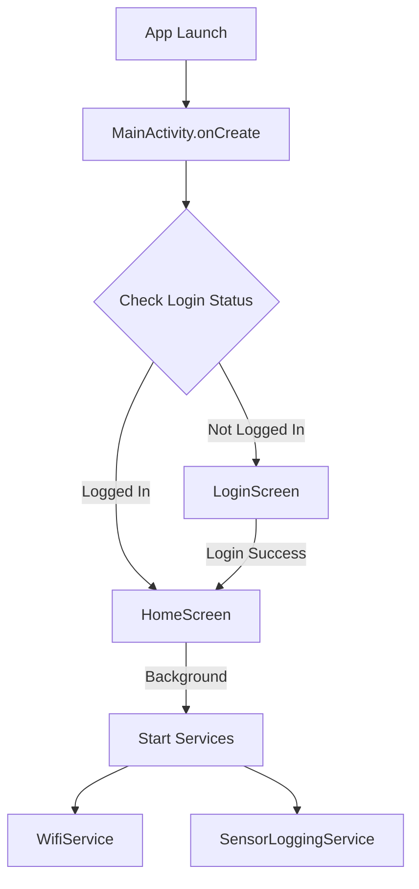
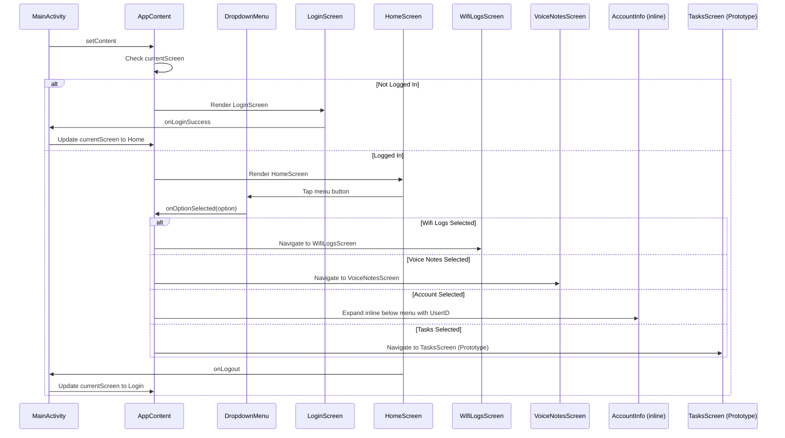
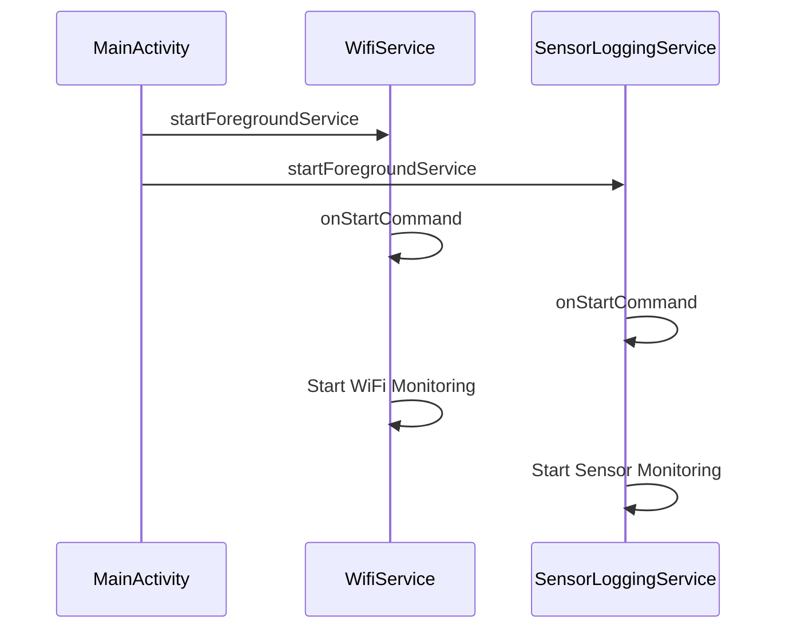
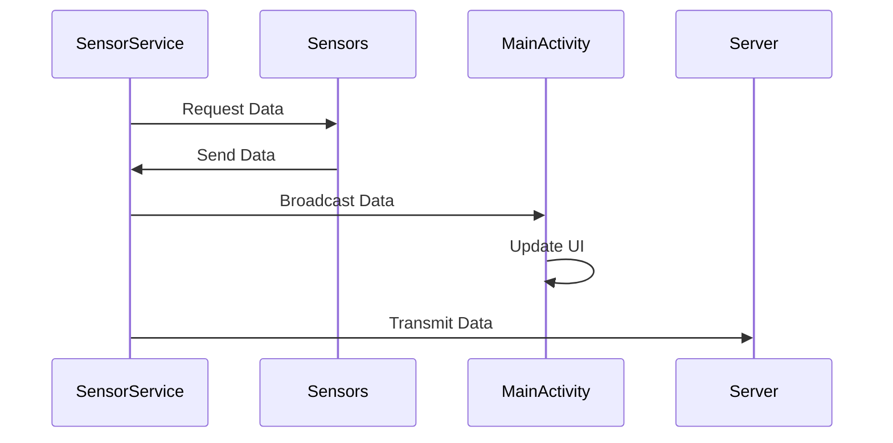
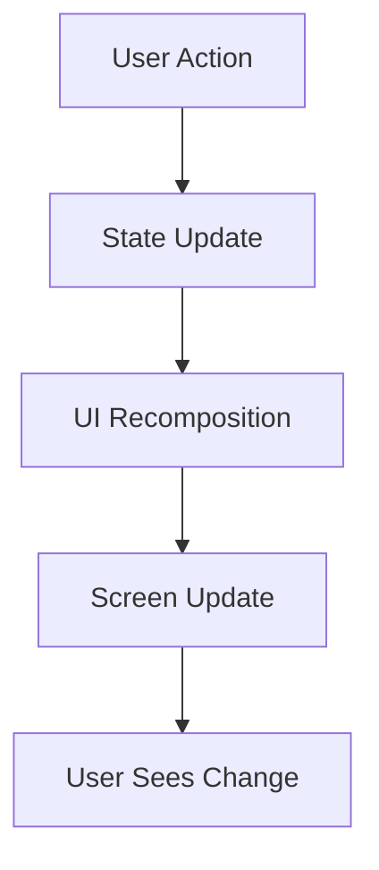
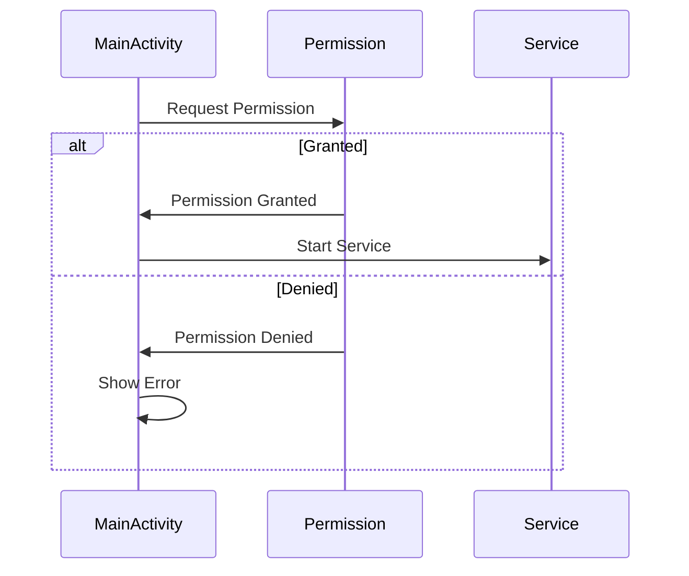
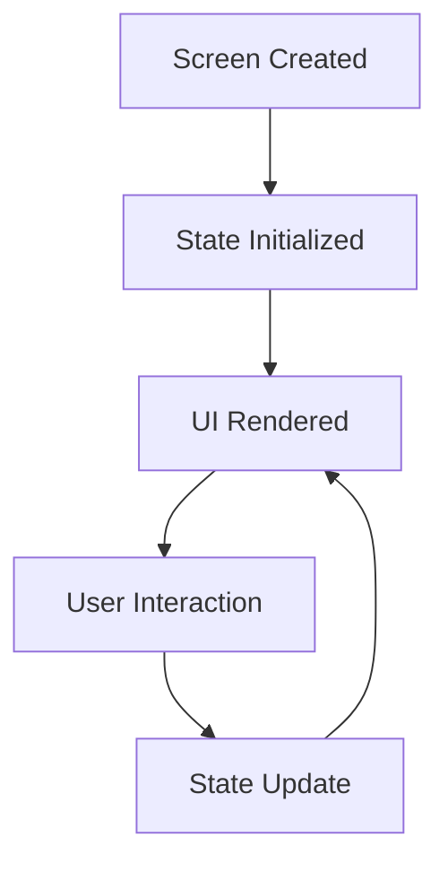

# WatchApp - Code Flow Documentation

## 🔄 Application Flow Overview



## 📱 Entry Point: MainActivity

### 1. Application Launch
```kotlin
class MainActivity : ComponentActivity() {
    override fun onCreate(savedInstanceState: Bundle?) {
        super.onCreate(savedInstanceState)
        // Initialize secure login cache
        loginCache = LoginCache(applicationContext)

        // Register BroadcastReceivers for data updates
        // statusSensorReceiver for data sending status from SensorLoggingService
        // wifiLogReceiver for Wi-Fi log messages from WifiService

        // Initialize permission launchers for Location, Body Sensors, and Activity Recognition

        // Determine the initial screen based on cached login state
        val initialScreen = if (checkIfUserIsLoggedIn() && cachedUserId != null) {
            userIdState.value = cachedUserId // Set the userIdState from cache
            Screen.Home
        } else {
            Screen.Login
        }

        // Set up the Jetpack Compose UI
        setContent {
            // Manages current screen state (Login, Home, etc.)
            // Handles potential deep links to specific screens
            AppContent(
                currentScreen = currentScreen,
                onNavigate = { screen: Screen -> currentScreen = screen },
                startSensorService = { empId, pin -> /* Handles permission checks and service start */ },
                stopSensorService = ::stopSensorLoggingService,
                stopWifiService = ::stopWifiService,
                userId = userIdState.value,
                heartRate = heartRateState.value,
                dataSendingStatus = dataSendingStatus.value,
                // ... other state and launcher parameters
                wifiLogs = wifiLogsState
            )
        }
    }

    override fun onResume() {
        super.onResume()
        // Checks login status and accessibility service enablement
        // Sets showAccessibilityPrompt.value to true if needed
        showAccessibilityPrompt.value = checkIfUserIsLoggedIn() && getCachedUserId() != null && !isAccessibilityServiceEnabled(this, ACCESSIBILITY_SERVICE_NAME)
    }

    override fun onDestroy() {
        super.onDestroy()
        // Unregisters all BroadcastReceivers to prevent leaks
        LocalBroadcastManager.getInstance(this).unregisterReceiver(statusSensorReceiver)
        LocalBroadcastManager.getInstance(this).unregisterReceiver(wifiLogReceiver)
    }
}
```
Explanation:

**Initialization**: When the app launches, MainActivity.onCreate initializes the LoginCache for secure data storage. It also sets up BroadcastReceivers (statusSensorReceiver, wifiLogReceiver) to listen for data updates from background services.

**Permission Launchers**: Permission request mechanisms for Location, Body Sensors, and Activity Recognition are prepared.

**Initial Screen Determination**: The app checks the user's login status and cached user ID to decide whether to initially display the LoginScreen or the HomeScreen. Deep linking (launching directly to a specific screen) is also supported.
UI Setup: Jetpack Compose is used to build the UI, managed by the AppContent Composable. It passes down navigation functions, service control lambdas, and various state variables.

**onResume()**: This lifecycle method ensures that if the user is logged in, has a cached ID, but has not yet enabled the necessary Accessibility Service, a prompt will be triggered.

**onDestroy()**: Crucially, this method unregisters all BroadcastReceivers, preventing memory leaks when the activity is destroyed.

### 2. Screen Navigation Flow


## 🔐 Authentication Flow

### 1. Login Process
```kotlin
// LoginScreen.kt
@Composable
fun LoginScreen(
    onLoginSuccess: (String, String) -> Unit,
    requestSensorPermissionLauncher: ActivityResultLauncher<String>,
    requestLocationPermissionLauncher: ActivityResultLauncher<Array<String>>,
    userId: String
) {
    var username by remember { mutableStateOf("") }
    var password by remember { mutableStateOf("") }
    var isLoggingIn by remember { mutableStateOf(false) }

    // Initial permission checks on compose launch (triggered by userId, ensuring it runs)
    LaunchedEffect(userId) {
        // Request BODY_SENSORS permission if not granted
        // Check and prompt for Accessibility Service if not enabled
    }

    Button(onClick = {
        if (!isLoggingIn) { // Prevent multiple clicks
            // 1. Check Wi-Fi connection
            if (!isWifiConnected(context)) {
                Toast.makeText(context, "Wi-Fi not connected", Toast.LENGTH_SHORT).show()
                return@Button
            }
            isLoggingIn = true // Disable button
            // 2. Send login request to API (simulated)
            sendLoginDataToApi(username, password, coroutineScope) { result ->
                isLoggingIn = false // Re-enable button
                if (result == "Login Success!") {
                    // 3. Save login state and user ID
                    loginCache.saveLoginStatus(true)
                    loginCache.saveUserId(username)
                    // 4. Navigate to home and trigger service start
                    onLoginSuccess(username, password)
                } else {
                    Toast.makeText(context, "Incorrect Employee ID or Password", Toast.LENGTH_SHORT).show()
                }
            }
        }
    }) {
        Text("Login")
    }
}
```

**User Input**: The user enters their Employee ID and Password.

**Pre-Login Checks**: Before attempting login, the app verifies Wi-Fi connectivity. It also uses a LaunchedEffect to perform initial permission checks for BODY_SENSORS and prompts for Accessibility Service if necessary.

**Simulated API Call**: sendLoginDataToApi is called. Currently, this function simulates a successful login without hitting a real API.
(**theres a commented out sendLoginDataToApi.comment back that one to use the actual login logic**)

**Login Success Logic**:
If the simulated login is successful, LoginCache stores the isLoggedIn status as true and saves the userId.
onLoginSuccess is invoked, which within AppContent, triggers the navigation to HomeScreen and calls startSensorService.

**Permission-gated Service Start**: The startSensorService function first checks for BODY_SENSORS and ACTIVITY_RECOGNITION permissions. If granted, it proceeds to start the SensorLoggingService. If not, it requests the missing permissions.(but not all of them,i cant figure how to get accessibility settings enabled)

## 🔄 Background Services Flow

### 1. Service Initialization

SensorLoggingService: This service is started by MainActivity via startForegroundService only after necessary permissions (BODY_SENSORS, ACTIVITY_RECOGNITION) are granted. Its onStartCommand method initiates sensor data collection.
WifiService: Important Note: In the current code, the call to start WifiService ((context as? MainActivity)?.startWifiServiceOnce()) in LoginScreen is commented out. Therefore, WifiService is not automatically started on successful login. If uncommented, its onStartCommand would create Wi-Fi network suggestions and begin monitoring.
### 2. WifiService Flow
```kotlin
class WifiService : Service() {
    override fun onStartCommand() {
        // 1. Create WiFi suggestion
        val suggestion = WifiNetworkSuggestion.Builder()
            .setSsid("")
            .setWpa2Passphrase("")
            .build()

        // 2. Add network suggestion
        wifiManager.addNetworkSuggestions(listOf(suggestion))

        // 3. Start monitoring connection
        startWifiMonitoring()
    }
}
```

### 3. SensorLoggingService Flow
```kotlin

```

## 📊 Data Flow

### 1. Sensor Data Collection


### 2. Data Storage Flow
```kotlin
class LoginCache(private val context: Context) {
    // 1. Initialize secure storage
    private val masterKey = MasterKey.Builder(context)
        .setKeyScheme(MasterKey.KeyScheme.AES256_GCM)
        .build()

    // 2. Create encrypted preferences
    private val sharedPreferences = EncryptedSharedPreferences.create(
        context,
        "login_cache",
        masterKey,
        ...
    )

    // 3. Save data
    fun saveLoginStatus(isLoggedIn: Boolean) {
        sharedPreferences.edit() { 
            putBoolean("isLoggedIn", isLoggedIn) 
        }
    }
}
```

## 🔄 State Management

### 1. UI State Flow


### 2. State Variables
```kotlin
// MainActivity.kt
private val dataSendingStatus = mutableStateOf("Not sending data")
private val gpsDataState = mutableStateOf("No GPS data yet")
private val latitudeState = mutableStateOf("...")
private val longitudeState = mutableStateOf("...")
private val userIdState = mutableStateOf("")
private val heartRateState = mutableStateOf("...")
```

## 🔍 Error Handling Flow

### 1. Permission Handling


### 2. Service Error Handling
```kotlin
try {
    startForegroundService(serviceIntent)
} catch (securityException: SecurityException) {
    Log.e("MainActivity", "Security Exception: ${securityException.message}")
    Toast.makeText(this, "Permission denied", Toast.LENGTH_LONG).show()
} catch (e: Exception) {
    Log.e("MainActivity", "Error: ${e.message}")
    Toast.makeText(this, "Service start failed", Toast.LENGTH_LONG).show()
}
```

## 📱 Screen Lifecycle

### 1. Screen State Management


### 2. Screen Navigation
```kotlin
enum class Screen {
    Login,
    Home,
    OptionsPage
}

@Composable
fun AppContent(
    currentScreen: Screen,
    onNavigate: (Screen) -> Unit,
    ...
) {
    when (currentScreen) {
        Screen.Login -> LoginScreen(...)
        Screen.Home -> HomeScreen(...)
        Screen.OptionsPage -> OptionsPage()
    }
}
```

---

*This documentation shows the main code execution paths in the application. Each component is designed to work independently while maintaining communication through well-defined interfaces and state management.*
