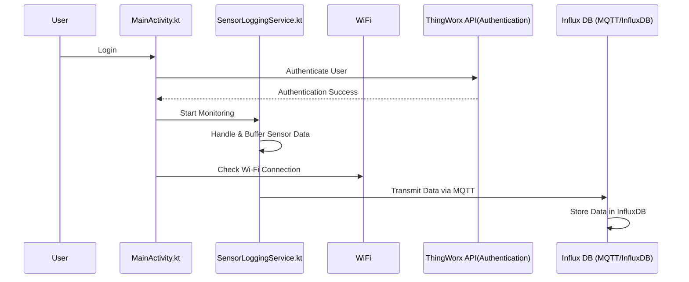

C

## 🏗️ Architecture

### Core Components

1. **MainActivity**
   - Entry point of the application
   - Manages screen navigation
   - Handles permission requests
   - Coordinates background services

2. **Services**
   - `WifiService`: Manages Wi-Fi connectivity
   - `SensorLoggingService`: Collects sensor data
   - `TouchAccessibilityService`: Handles touch events(used to keep screen alive,dont need anymore)

3. **Data Management**
   - `LoginCache`: Secure storage for user credentials
   - Encrypted SharedPreferences for sensitive data

## 📊 Data Flow




## 🛠️ Technical Implementation

### Login Process

1. User enters credentials
2. App checks Wi-Fi connectivity
3. Credentials are validated
4. Session is encrypted and stored
5. Background services are initialized

### Background Services

#### WifiService
- Manages Wi-Fi connections
- Handles silent reconnection
- Monitors connection status

#### SensorLoggingService
- Collects heart rate data
- Tracks GPS location
- Monitors step count
- Transmits data to server

## 📱 UI Components

### Screens

1. **Login Screen**
   - Employee ID input
   - PIN input
   - Login button
   - Status messages

2. **Home Screen**
   - User information
   - Real-time sensor data
   - Wi-Fi status
   - Logout button

3. **Options Page**
   - Additional settings
   - Configuration options

## 🔧 Setup and Configuration

### Prerequisites
- Android Wear OS device
- Android Studio
- Minimum SDK version: 30
- Target SDK version: 30(need to be this or older because eclipse paho doesnt work for newer android api yet)

### Required Permissions
```xml
<uses-permission android:name="android.permission.BODY_SENSORS" />
<uses-permission android:name="android.permission.ACCESS_FINE_LOCATION" />
<uses-permission android:name="android.permission.ACCESS_COARSE_LOCATION" />
<uses-permission android:name="android.permission.ACTIVITY_RECOGNITION" />
```

## 🚀 Deployment

1. Build the application
2. Sign the APK
3. Install on target device
4. Configure initial settings
5. Test all features

## 🔍 Troubleshooting

### Common Issues

1. **Wi-Fi Connection Issues**
   - Check device Wi-Fi settings
   - Verify network credentials
   - Restart WifiService

2. **Sensor Data Not Updating**
   - Verify permissions
   - Check sensor availability
   - Restart SensorLoggingService

3. **Login Problems**
   - Clear app data
   - Verify credentials
   - Check network connectivity

## 📈 Future Enhancements

1. Enhanced data visualization
2. Additional sensor support
3. Improved error handling
4. Extended API integration
5. Advanced security features

## 🤝 Support

For technical support or feature requests, please contact:
- Email: [Support Email]
- Issue Tracker: [Repository URL]

## 📄 License

[License Information]

---

*Documentation last updated: [Current Date]* 
