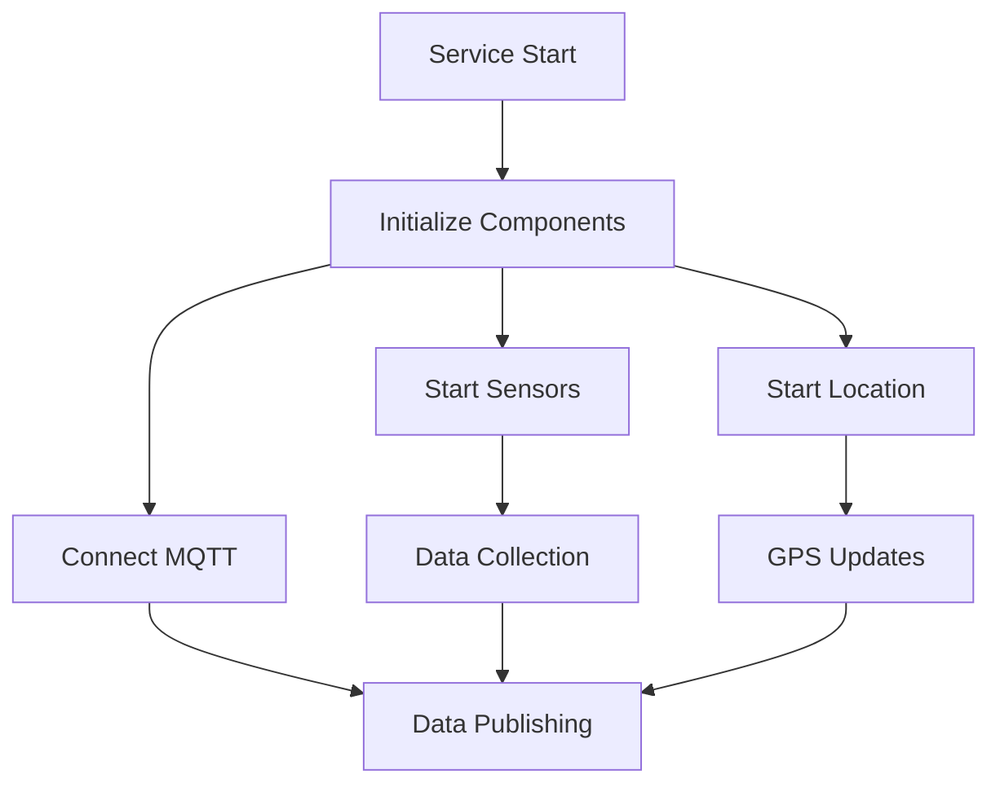
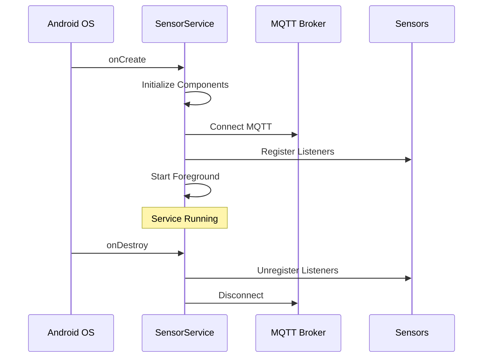
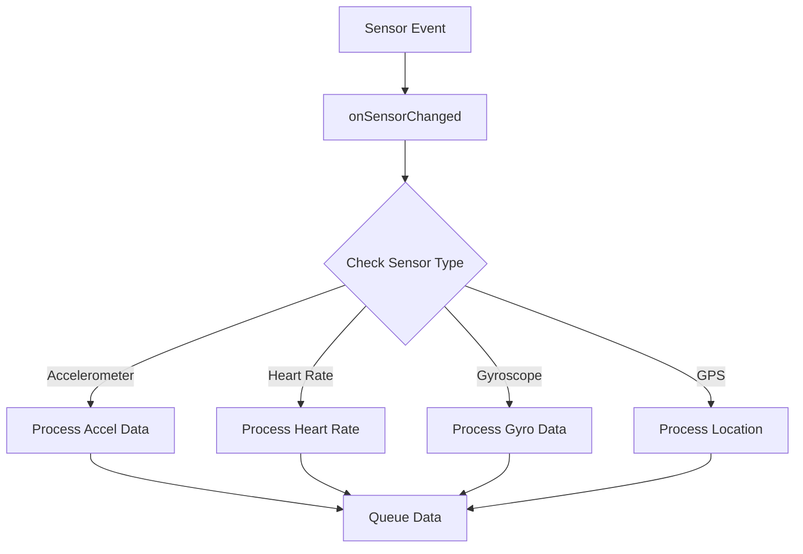
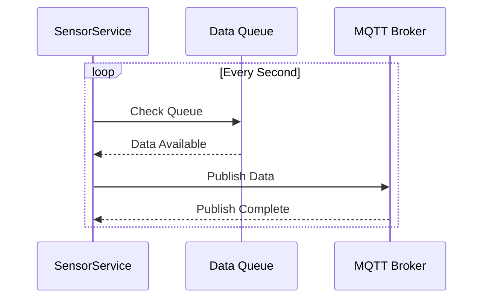
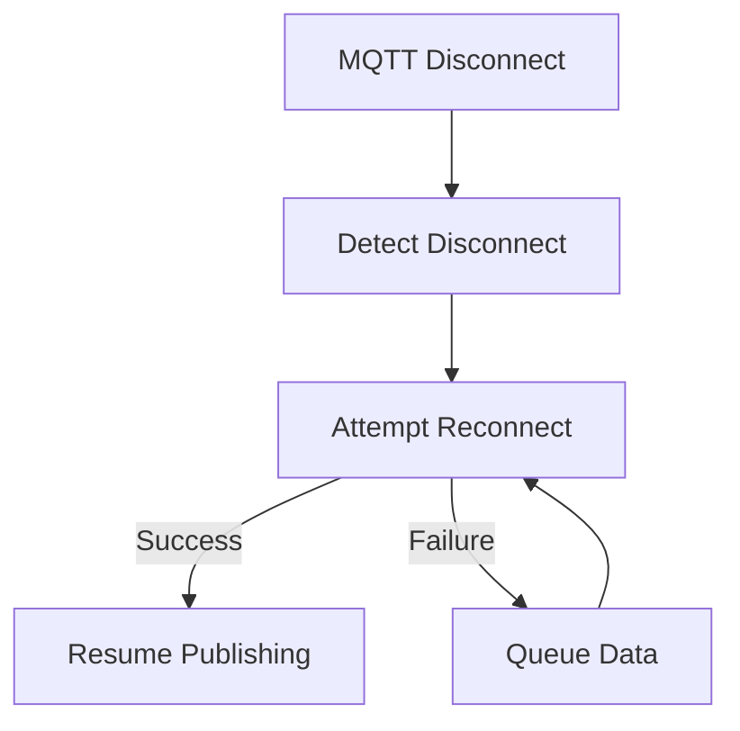
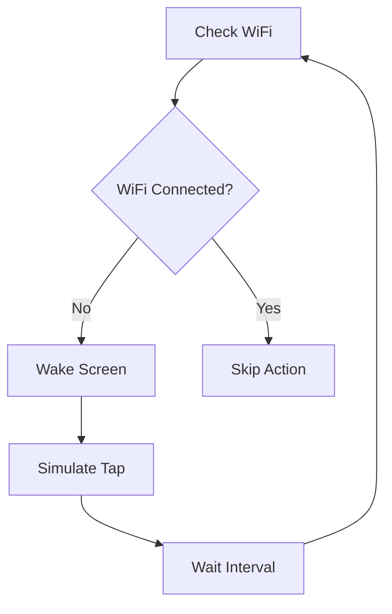
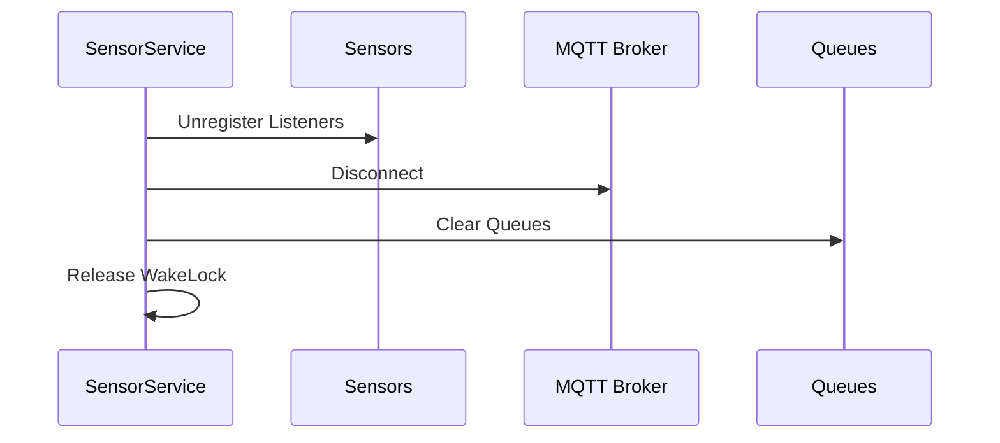

# SensorLoggingService - Technical Flow Documentation

## 📝 Brief Description

The SensorLoggingService is a critical background service that handles sensor data collection and transmission in the Wear OS application. Here's what it does:

1. **MQTT Connection & Publishing**
```kotlin
// MQTT Configuration
private lateinit var mqttClient: MqttAndroidClient
private val mqttBrokerUri = "tcp://10.107.106.133:1883"
private val mqttClientId = "WearOSSensorLogger"

// Publishing to MQTT
private fun publishMqttInternal(topic: String, message: String) {
    if (mqttClient.isConnected) {
        mqttClient.publish(topic, MqttMessage(message.toByteArray()))
    }
}
```

2. **Data Caching with Queues**
```kotlin
// Queue Configuration for Data Caching
private val gpsDataQueue = ArrayBlockingQueue<String>(5000)      // GPS data cache
private val accelDataQueue = ArrayBlockingQueue<String>(5000)    // Accelerometer data cache
private val heartRateDataQueue = ArrayBlockingQueue<String>(5000) // Heart rate data cache
private val gyroDataQueue = ArrayBlockingQueue<String>(5000)     // Gyroscope data cache
```

3. **Sensor Data Collection**
- Accelerometer (x, y, z coordinates)
- Heart Rate (BPM)
- GPS Location (latitude, longitude)
- Gyroscope (rotation data)
- Step Detection
- Linear Acceleration
- Rotation Vector

4. **Background Processing**
- Maintains a foreground service to prevent system kill
- Implements keep-alive mechanism for WiFi connection
- Monitors memory usage and queue sizes
- Handles automatic reconnection to MQTT broker

5. **Error Recovery**
- Implements retry mechanism for failed MQTT publishes
- Caches data when offline
- Automatically reconnects to MQTT broker
- Handles sensor unavailability gracefully

The service uses a queue-based architecture to ensure no data is lost when the device is offline or experiencing connectivity issues. Each sensor type has its own dedicated queue with a capacity of 5000 entries(arbitary value,but i tested it for a few times and it seems to cache up to 4 hours consistently and reliably,aftet that maybe due to some inherent features of the watch or memeory space it stops caching continuosly), allowing for robust data caching during network interruptions.

## 🔄 Service Overview



## 📱 Service Initialization Flow
This service uses the MqttManager singleton to handle MQTT setup and publishing to avoid redundant reconnects and ensure a shared mqttClient across components like SensorLoggingService
```kotlin
MqttManager.connect(applicationContext, mqttBrokerUri, mqttClientId)
```
### 1. Service Creation
```kotlin
class SensorLoggingService : Service(), SensorEventListener {
    // 1. Sensor Managers
    private lateinit var sensorManager: SensorManager
    private var accelerometerSensor: Sensor? = null
    private var heartRateSensor: Sensor? = null
    private var gyroscopeSensor: Sensor? = null
    // ... other sensors

    // 2. MQTT Configuration
    private lateinit var mqttClient: MqttAndroidClient
    private val mqttBrokerUri = "tcp://10.107.106.133:1883"
    private val mqttClientId = "WearOSSensorLogger"

    // 3. Data Queues
    private val gpsDataQueue = ArrayBlockingQueue<String>(5000)
    private val accelDataQueue = ArrayBlockingQueue<String>(5000)
    private val heartRateDataQueue = ArrayBlockingQueue<String>(5000)
    // ... other queues
}
```

### 2. Service Lifecycle


## 🔄 Data Collection Flow
**If unable to publish using MQTT,then collected sensor data are just cached into a queue,when reconnected to MQTT broker,then pop from top of queue to publish**

### 1. Sensor Data Collection(thers also linear accelration and roation vector etc.. but u get the idea)


### 2. Data Processing
```kotlin
override fun onSensorChanged(event: SensorEvent?) {
    event?.let { it ->
        when (it.sensor.type) {
            Sensor.TYPE_ACCELEROMETER -> {
                // 1. Get values
                val x = it.values[0]
                val y = it.values[1]
                val z = it.values[2]

                // 2. Format data
                val influxLine = "accelerometer,watch=${watchModel}..." +
                    "x=$x,y=$y,z=$z ${currentTimeMillis * 1_000_000}"

                // 3. Queue data
                accelDataQueue.offer(influxLine)
            }
            // ... other sensor types
        }
    }
}
```

## 📊 Data Publishing Flow

### 1. MQTT Publishing


### 2. Queue Management
```kotlin
private fun publishQueuedData() {
    // 1. Check MQTT Connection
    if (!mqttClient.isConnected) {
        Log.d("AccelPublish", "Still offline – buffering data.")
        return
    }

    // 2. Process Each Queue
    accelDataQueue.poll()?.let { currentAccelData ->
        publishMqttInternal(mqttTopic, currentAccelData)
    }

    // 3. Handle Heart Rate
    heartRateDataQueue.poll()?.let { currentHeartRateData ->
        publishMqttInternal(mqttHeartRateTopic, currentHeartRateData)
    }

    // 4. Handle GPS
    gpsDataQueue.poll()?.let { currentGpsData ->
        publishMqttInternal(mqttGpsTopic, currentGpsData)
    }
}
```

## 🔐 Error Handling and Recovery

### 1. MQTT Connection Management


### 2. Error Recovery
```kotlin
private fun publishMqttInternal(topic: String, message: String, maxRetries: Int = 3) {
    var attempts = 0
    while (attempts <= maxRetries) {
        if (mqttClient.isConnected) {
            try {
                // Attempt to publish
                mqttClient.publish(topic, MqttMessage(message.toByteArray()))
                return // Success
            } catch (e: MqttException) {
                attempts++
                if (attempts <= maxRetries) {
                    Thread.sleep(1000) // Wait before retry
                }
            }
        } else {
            connectMqtt() // Attempt reconnection
            return
        }
    }
}
```

## 🔄 Background Processing

### 1. Keep-Alive Mechanism


### 2. Memory Management
```kotlin
private fun logAppMemoryUsage() {
    val runtime = Runtime.getRuntime()
    val usedMemInMB = (runtime.totalMemory() - runtime.freeMemory()) / 1024 / 1024
    val maxHeapSizeInMB = runtime.maxMemory() / 1024 / 1024
    
    Log.i("QueueMonitor", "🧠 App Used Heap: $usedMemInMB MB")
    Log.i("QueueMonitor", "🚀 App Max Heap: $maxHeapSizeInMB MB")
}
```

## 📱 Service Cleanup

### 1. Resource Cleanup


### 2. Cleanup Implementation
```kotlin
override fun onDestroy() {
    super.onDestroy()
    // 1. Stop sensors
    sensorManager.unregisterListener(this)
    
    // 2. Stop location updates
    fusedLocationClient.removeLocationUpdates(locationCallback)
    
    // 3. Stop background tasks
    keepAliveHandler.removeCallbacksAndMessages(null)
    queueLoggerHandler.removeCallbacksAndMessages(null)
    
    // 4. Release resources
    releaseWakeLock()
    publishingScheduler.shutdown()
    
    // 5. Disconnect MQTT
    disconnectMqtt()
}
```

## 🔍 Performance Monitoring

### 1. Queue Monitoring
```kotlin
private fun startQueueContentLogger() {
    queueLoggerHandler.post(object : Runnable {
        override fun run() {
            // Log queue sizes
            logQueueContents("accelDataQueue", accelDataQueue)
            logQueueContents("gpsDataQueue", gpsDataQueue)
            logQueueContents("heartRateDataQueue", heartRateDataQueue)
            
            // Schedule next check
            queueLoggerHandler.postDelayed(this, queueLogIntervalMillis)
        }
    })
}
```

### 2. Memory Monitoring
```kotlin
private fun logQueueContents(queueName: String, queue: ArrayBlockingQueue<String>): Int {
    val items = queue.toList()
    val approxSizeBytes = items.sumOf { it.toByteArray().size }
    val sizeKb = approxSizeBytes / 1024
    
    Log.i("QueueMonitor", "===== $queueName (size=${items.size}, ~${sizeKb}KB) =====")
    return sizeKb
}
```

---

*This documentation details the technical implementation of the SensorLoggingService, showing how it manages sensor data collection, MQTT communication, and background processing while maintaining performance and reliability.* 
